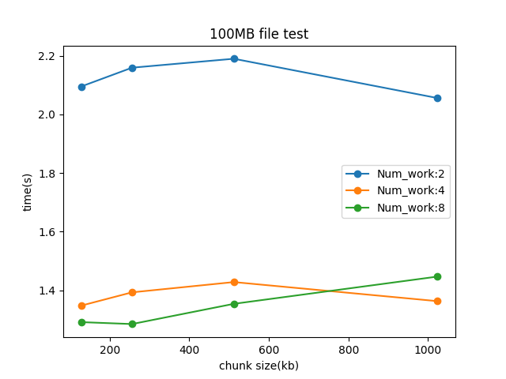
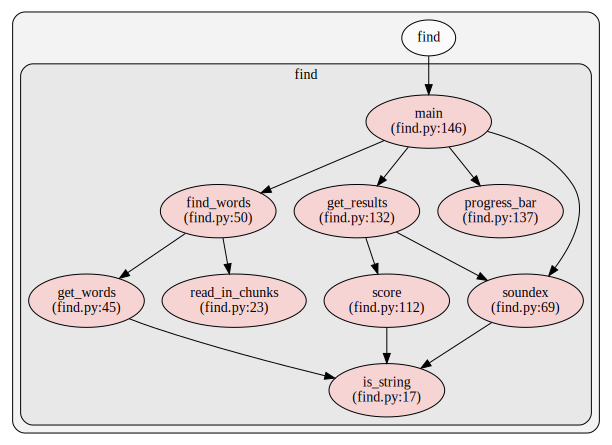

## Couple of words

Had lot of fun making this, real challenge was to get multiprocessing to use least memory. There are some caveats in Python when it goes to that, more below. Overall I think it turned out ok. 

## Running/Options

    $ ./find.py [OPTIONS] [FILEPATH] [KEYWORD]

    --workers -w                    set number or workers, default : 1

    --chunk_size -cs                set chunk size(kb) default: 2kb for single process and 128 for worker>1

## Requirements

    pip install -r requirements.txt

## Testing

To run tests, run below in main directory:

    python -m unittest

You can then choose to include speed test via console input. This will take a while, depending on your os; more below.

## Additional info:

### Speed

From testing that I've done on my not-so-new 4/8 CPU laptop running on Linux, 100MB file peaks at 1.2sec. This is best case scenario using 4 workers, using single process or running on Windows makes it considerably slower.  At some point increasing number of workers doesn't yield benefit. I would stick to `-w 4`. Smaller files < 1Mb are quicker with single process due to time it takes to spawn additional processes.

### Memory use

This was tricky topic. Good news you can definitely run 4GB+ files and not run out of memory. Single process requires around 10 MB and each additional will be around the same although it will also increase memory use of main process. As said above if you stick to max 4 workers you should expect around 60MB usage, regardless of the file size. This goes up with chunk size as well.  

There are some caveats, for ex. each child process will inherit imports from parent module and any large objects. Since main script modules are pretty light-weight I left it alone. 

In test_speed.py you can see that I restricted whole script to only tests module so that child processes are not importing additional stuff. It works as memory was peaking at 50MB for each process and this reduced it back to 10MB. I am not sure if that's proper way to do it, it works but requires some reasearch :) 
### Call graph:


Generated with [pyan](https://github.com/davidfraser/pyan)

___

# Task for Great Python developer

If you found this task it means we are looking for you!

## Task

### Word Search

Implement a CLI tool that finds phrases in a given text file. Search phrase (single word) can be misspelled. 
Use American Soundex algorithm to match words - https://en.wikipedia.org/wiki/Soundex. 
Software should return the top unique 5 matched words.

Sample file wiki_lt.txt:
```
   Lithuania (UK and US: Listeni/ˌlɪθuːˈeɪniə/,[11][12][13] Lithuanian: Lietuva
   [lʲɪɛtʊˈvɐ]), officially the Republic of Lithuania (Lithuanian: Lietuvos
   Respublika), is a country in Northern Europe.[14] One of the three Baltic
   states, it is situated along the southeastern shore of the Baltic Sea, to the
   east of Sweden and Denmark. It is bordered by Latvia to the north, Belarus to
   the east and south, Poland to the south, and Kaliningrad Oblast (a Russian
   exclave) to the southwest. Lithuania has an estimated population of 2.9 million
   people as of 2015, and its capital and largest city is Vilnius. Lithuanians are
   a Baltic people. The official language, Lithuanian, along with Latvian, is one
   of only two living languages in the Baltic branch of the Indo-European language
   family.
```

Sample usage:

`$ ./find.py wiki_lt.txt lituania`

Sample output:
```
   Lithuania
   Lithuanian
   Lietuva
   Listeni
   living
```
The exact results might be different because of different scoring, matching, sorting algorithms, etc.

NOTE that given text file might be larger than we have RAM on our machine, e.g. +4 GB, etc.
Any parallelized optimizations are encouraged.

## Few simple steps

1. Fork this repo
2. Do your best
3. Prepare pull request and let us know that you are done

## Few simple requirements

- Use Python 3.
- It should be easy to identify candidate's code. It should not be buried inside some framework directory structure.
- Proper error handling must be implemented, user input must be validated.

## Bonus

- The more code is covered with automated tests, the better. Unit, integration, end to end tests, etc. are all encouraged.
- Use [PEP 8 style guide](http://pep8.org/).
- Use pylint, flake8 or any other tool to statically test code.
- Use [mypy type hints](http://www.mypy-lang.org/).
